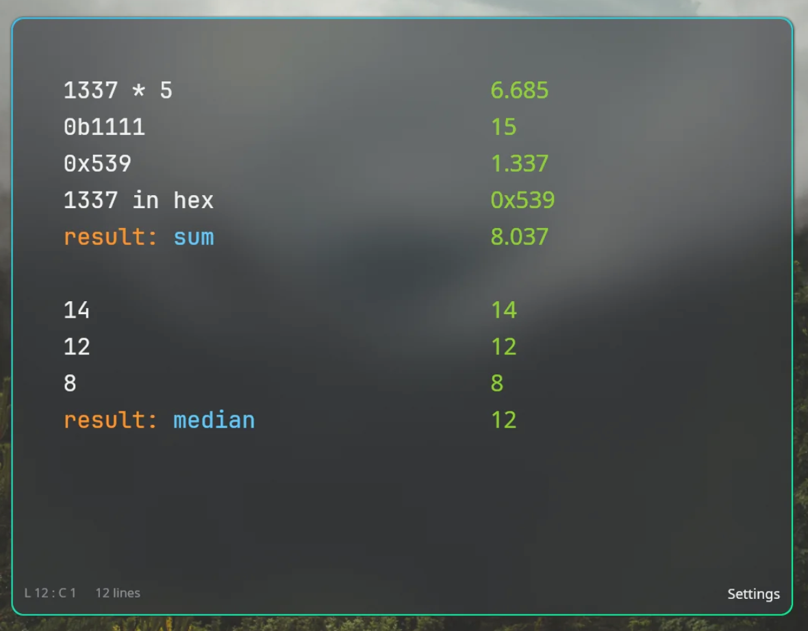

# numbr

[](https://github.com/alexjoedt/numbr/actions/workflows/ci.yml)

A natural-language calculator for Linux/Wayland, optimized for Hyprland.
Inspired by [Numi](https://numi.app), with a focus on developer workflows.



```
10 km in miles                   6.21371 miles
sqrt(2) * 3                      4.242640687
0xFF in binary                   0b11111111
255 as int16                     -1
price = 42; price * 3            126
modbus::float32(0x4128, 0x0000)  10.5
today + 2 weeks                  2026-07-18
```

## Features

- Arithmetic, percentages (`5% of 200`, `price - 20%`), variables, line references (`line1`)
- Scientific functions: `sqrt`, `sin`, `cos`, `tan`, `log`, `ln`, `exp`, `abs`, …
- Number systems: `0xFF`, `0b1010`, `0o17`; convert with `in hex`, `in binary`, `in octal`
- Bit widths: `255 as int8` → `-1` (two's complement), `0xFFFF as int16` → `-1`
- Bit operations: `&`, `|`, `^`, `~`, `<<`, `>>`, `popcount`, `clz`, `ctz`
- Modbus register conversion: `modbus::float32`, `modbus::int32`, `modbus::uint32`, word-order variants
- Unit conversion: length, mass, temperature, pressure, data size, time
- Date arithmetic: `today + 2 weeks`, `diff(2026-07-04, 2026-01-01) in days`
- Session persistence: last session is automatically restored on startup
- Clipboard: click any result to copy it

## Platform

numbr is a Wayland application and runs on Linux only. It does not build on macOS or
Windows. Building requires the Wayland, xkbcommon and EGL development headers:

```bash
sudo apt install libwayland-dev libxkbcommon-dev libegl-dev   # Debian/Ubuntu
sudo pacman -S wayland libxkbcommon mesa                      # Arch
```

## Install

### Prebuilt binary

Download the `x86_64-unknown-linux-gnu` tarball from the
[releases page](https://github.com/alexjoedt/numbr/releases), extract it, and run
`numbr` from anywhere on your `$PATH`.

### From source

Requires the system packages listed under [Platform](#platform) and Rust 1.86.0 or
newer (MSRV).

```bash
cargo build --release
```

The binary is placed at `target/release/numbr`.

## Hyprland integration

Add to your `hyprland.lua` (or any file you `require` from it):

```lua
-- Launch numbr with Super+Shift+C
hl.bind("SUPER + SHIFT + C", hl.dsp.exec_cmd("numbr"), { description = "Calculator" })

-- Float it, centre it, give it a fixed size
hl.window_rule({
    match  = { class = "^(numbr)$" },
    float  = true,
    size   = { 680, 520 },
    center = true,
})
```

Close the window when you are done. Your session is saved automatically and
restored next time you open numbr.

## Usage tips

- **Multi-line notebook**: each line is evaluated independently; previous results
  are accessible as `line1`, `line2`, …
- **Variables**: `price = 42; price * 3`
- **Comments**: lines starting with `#` are ignored
- **Clipboard**: click any result in the right column to copy it

## Status

numbr is alpha software (`0.x`). The expression syntax may change between releases and
there is no stability guarantee yet.

## License

Licensed under either of

- Apache License, Version 2.0 ([LICENSE-APACHE](LICENSE-APACHE))
- MIT license ([LICENSE-MIT](LICENSE-MIT))

at your option.

### Contribution

Unless you explicitly state otherwise, any contribution intentionally submitted
for inclusion in the work by you, as defined in the Apache-2.0 license, shall be
dual licensed as above, without any additional terms or conditions.

## Contributing

See [CONTRIBUTING.md](CONTRIBUTING.md) for how to build, test, and submit a change.
